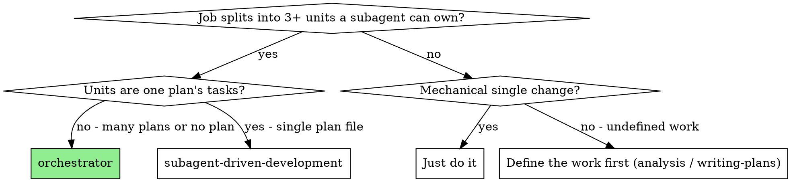

# Orchestrator

Drive a large body of work from one session without spending that session's
context on the work itself. You own the work list, the order, the dispatches,
the verdicts and the bookkeeping. Subagents own the work.

**Announce at start:** "I'm using the orchestrator skill to drive this work."

**Core principle:** the orchestrator never does the work. It reads lists, not
bodies; it passes paths, not contents; it delegates every unit and keeps only
the short verdicts.

**Why:** a session that does six units itself runs out of context around unit
three, and a controller that lost its place has been observed re-dispatching
work it had already completed. Delegation plus a ledger makes a run survive both
compaction and a fresh session.

**Narration:** at most one short line between tool calls. The ledger and the
work list carry the record.

## When to Use

Any job that decomposes into units a subagent can own end to end, and is large
enough that doing it inline would crowd out the coordination. It does not have
to be a plan.

| Kind of job | Unit |
|---|---|
| Multi-phase plan index | one phase plan |
| Migration / mechanical sweep | one module, package or file group |
| Batch of bugs or failing suites | one bug, one suite |
| Audit, survey, inventory across a codebase | one area (read-only) |
| Documentation or translation pass | one document or locale |
| Dependency or API upgrade | one call-site cluster |
| Research across many sources | one source or question |



**Don't use when:**
- One plan file with a handful of tasks — cf-powers:subagent-driven-development
  already is that loop; this layer would be pure overhead
- The units are tightly coupled — each one needs the others' full context, so
  splitting them just multiplies re-reading
- The work is not defined yet — use cf-powers:analysis first. An orchestrator
  cannot delegate a question
- It is one mechanical change — do it

**Relation to the other execution skills:**

| Skill | Scope |
|---|---|
| **orchestrator** | Many units of any kind. Delegates each whole, tracks a work list. |
| **subagent-driven-development** | One plan file. Fresh implementer per task, review per task. |
| **executing-plans** | One plan, executed by hand with human checkpoints. |
| **dispatching-parallel-agents** | The parallel-dispatch mechanics this skill borrows. |

## Model Selection

**REQUIRED SUB-SKILL:** cf-powers:choosing-subagent-models. Read it before the
first dispatch and set `model` explicitly on every one.

The shape it usually takes here: Haiku for mechanical sweeps, Sonnet for units
whose shape is already decided, Opus for every review and for any unit with an
open design question. The orchestrator itself stays on the session's model — it
only coordinates.

## Setup

1. **Branch check.** `git branch --show-current`. On `main`/`master` with code
   changes ahead: STOP and ask your human partner for a feature branch. Never
   create worktrees on your own initiative. Read-only jobs (audits, surveys)
   need no branch.
2. **Workspace.** Run this skill's `scripts/orchestrator-workspace NAME` — pass
   the file the run is driven from (a plan index, a work-list file) or a bare
   slug for a job with no file behind it (`orchestrator-workspace
   invoice-api-upgrade`). It prints this run's git-ignored directory. Every
   artifact of the run lives there: ledger, unit briefs, reports, review
   packages. A sibling directory belongs to another run.
3. **Run ledger.** Check `<workspace>/run.md`. If its first line names your job,
   units with a `Unit <N>: complete` line are DONE — never re-dispatch them;
   resume at the first unit without one. If the file is absent, create it with
   its identity first: `# Orchestrator run — job: <index path or job name>`.
   After compaction, trust the ledger and `git log` over your own recollection.
4. **Establish the work list.** This is the one thing you must not delegate.
   - **It already exists** (a plan index, a checklist, a list the user gave
     you): read *that* — the phases, paths, statuses, dependencies. Do NOT read
     the unit bodies. Reading six plan bodies is exactly the context you came
     here to protect.
   - **It doesn't exist yet:** scout for it cheaply — `grep`/`find` for the call
     sites, the failing suites, the files in scope — or dispatch one read-only
     survey subagent that returns a list and nothing else. Then write the list
     to `<workspace>/units.md`, one line per unit: id, scope, dependencies,
     acceptance. That file is now the work list, and the ledger refers to it.
   - Either way, create one todo per unit.
5. **Pre-flight.** From the list alone, check for units that contradict each
   other, an ordering the dependencies forbid, or two units that would edit the
   same files. A shared-file collision is a **merge signal, not a question**:
   two units that cannot run in parallel because they touch the same files are
   one unit. Merge them, rewrite the work list, then dispatch. Ask your human
   partner only when the merged unit would exceed what one executor can hold.
   Contradictions and impossible orderings go to them as one batched question
   before unit 1. If it is clean, proceed without comment. **Why:** a
   twelve-unit index with four shared-file groups bought twelve rounds of
   dispatch, review and bookkeeping and no parallelism at all.

## The Unit Loop

For each unit, in dependency order:

### 1. Choose the route

| Signal | Route |
|---|---|
| Unit is self-contained and its scope is concrete | **Delegate the whole unit** to one executor |
| Unit is a plan file with many coupled tasks, or carries real risk | **Run cf-powers:subagent-driven-development** on it |
| Unit is read-only (audit, survey, inventory) | Delegate; several such units may run in parallel |
| Unit is a verification or release sweep | Delegate whole, with the command list in the dispatch |

When in doubt, delegate whole: you can always fall back to per-task execution
for that unit if the executor returns BLOCKED or NEEDS_CONTEXT.

### 2. Dispatch the unit

For code-changing work, record `BASE=$(git rev-parse HEAD)` first — the review
package needs it.

Dispatch one executor with [unit-executor-prompt.md](unit-executor-prompt.md).
It gets: the **path** to its scope (plan file, work-list line, file list — not
the contents), a report-file path in the workspace, one line on where the unit
sits in the job, the binding constraints copied verbatim, and any interface an
earlier unit decided that its own scope cannot tell it.

A dispatch describes one unit, not the run's history. Never paste accumulated
prior-unit summaries into a later dispatch — that habit has produced 42k-char
dispatches that were 99% history.

**Never dispatch two writing units in parallel on the same branch** — they
collide in the working tree and in git. Parallel is for read-only units, or for
writing units in isolated worktrees when the runtime supports them and you are
willing to pay the merge. See cf-powers:dispatching-parallel-agents.

Record the executor's agent identity from the dispatch result — fix rounds
resume it.

### 3. Handle the report

**DONE** → review it. **DONE_WITH_CONCERNS** → read the concerns; correctness or
scope concerns get resolved before review, observations get noted.
**NEEDS_CONTEXT** → supply what was missing and re-dispatch. **BLOCKED** →
change something: more context, a tier up, a smaller unit, or escalate that the
job's definition is wrong. Never make the same model retry unchanged.

### 4. Review the unit

Every unit gets a review before it is closed. For code, build the package with
cf-powers:subagent-driven-development's `scripts/review-package SCOPE_FILE BASE HEAD`
and hand the reviewer the printed path. Never review from your own reading of
the diff — the diff must not enter your context.

Dispatch `cf-powers:code-reviewer` on **Opus** (leave `model` unset — the
session default) with the package path, the unit's
scope path, the executor's report path, and the binding constraints verbatim. Do
not pre-judge findings for the reviewer. For a non-code unit (research, audit,
docs), review means the same thing with a different artifact: a reviewer reads
the unit's output against its acceptance line.

### 5. The fix loop

Three rounds maximum per unit. Rounds 1-2 resume the executor with the open
findings verbatim; round 3 dispatches a fresh executor one tier up, framed as "a
prior executor attempted this twice; you own it now — read the report file."
Each round ends with a scoped re-review
([re-review-prompt.md](../subagent-driven-development/re-review-prompt.md)) over
the fix diff only.

Minor findings never enter the loop — record them as
`Unit <N>: minor (deferred): <one-liner>` for the final review to triage.

A finding that conflicts with what the job's definition mandates is your human
partner's call: present the finding beside that text and ask which governs.

At the cap, adjudicate each open finding and write the ruling to the ledger —
park it if nothing downstream builds on it, STOP as
`Unit <N>: BLOCKED — <reason>` if it is load-bearing. Silent discards are
forbidden.

**Never fix findings yourself.** A controller fix pollutes your context and
skips review.

### 6. Close the unit

In one message:
- append `Unit <N>: complete (commits <base7>..<head7>, review clean)` — or
  `…, <K> parked` after a tripped breaker — to the run ledger
- update the unit's status in the work list (`⬚` → `✅` in a plan index, the
  status column in `units.md`). A **tracked** index never gets a commit of its
  own: fold the cell into the unit's last commit (`git commit --amend
  --no-edit` before anything else lands) or batch the cells once per phase.
  The ledger already carries the status; single-cell index commits were 22 of
  one branch's 117.
- mark the todo complete

### 7. Decide: continue or hand off

At every unit boundary, judge whether this session should take the next one.
Hand off when context is running short, when reports start coming back
summarised, or when the remaining units clearly exceed what is left.

To hand off: write `<workspace>/handoff.md` with the job identity, the workspace
path, the ledger's completed lines, the parked findings, and any interface a
later unit needs. Then tell your human partner where the run stands and give
them the resume line: *"new session: invoke cf-powers:orchestrator on
`<job>`"*. The ledger makes the resume free — there is nothing to reconstruct.

Otherwise take the next unit without asking. Do not pause for "should I
continue?" between units — they asked for the job, not for the first unit.

## Finish

When the last unit is complete, review the whole job once. For code:
`scripts/review-package SCOPE_FILE MERGE_BASE HEAD` (MERGE_BASE =
`git merge-base main HEAD`) dispatched to `cf-powers:code-reviewer` on Opus,
pointed at the ledger's deferred-minor and parked lines so it can triage what
must be fixed before merge. For a non-code job, the equivalent is one reviewer
over the assembled output against the original request.

Findings get **one** fix dispatch with the complete list — not one fixer per
finding; per-finding fixers each rebuild context and re-run suites. Then exactly
one scoped re-review. Residual findings are adjudicated as in the unit loop.

Then: cf-powers:documenting-changes if code changed, delete this run's workspace
(`rm -rf <workspace>` — git history and the delivered output are the record
now), and cf-powers:finishing-a-development-branch to integrate.

## Common Rationalizations

| Excuse | Reality |
|---|---|
| "I'll read all six plans / all the files first to understand the whole thing" | That is the context you came here to protect. The list is the map; the executor reads its own scope. |
| "This unit is tiny, I'll just do it myself" | One inline unit becomes three. Delegate it — the dispatch costs less context than the edit. |
| "I'll paste the last unit's report into the next dispatch" | A fresh executor needs its scope, its interfaces and the constraints. Accumulated history is what blew up past sessions. |
| "Both units are independent, dispatch them together" | Two writers on one branch collide. Parallel is for read-only units or isolated worktrees. |
| "The executor's diff looks fine to me" | Reading it puts it in your context and skips a real review. Dispatch the reviewer. |
| "Reviews on Sonnet, the diff is small" | Reviews are Opus. Diff size does not change who is qualified to judge it. |
| "There's no plan, so there's no work list" | Then building the list is step one — scout it and write it down. An unwritten list is what gets half-executed. |
| "The ledger is bookkeeping overhead" | It is the only thing that survives compaction. Without it, completed units get re-run. |
| "Ask the partner which unit is next" | The list already answered that. Ask only when it is ambiguous or blocked. |
| "Two units share a file — I'll ask how to sequence them" | Sharing files means they are one unit. Merge, rewrite the list, dispatch. |
| "One status commit per unit keeps history honest" | The ledger is the record. Fold the cell into the unit's last commit or batch per phase. |

## Example: a plan index

```
You: I'm using the orchestrator skill to drive this work.

[git branch --show-current → feature/big-thing ✅]
[scripts/orchestrator-workspace docs/plans/2026-08-22-big-thing-plan-index.md
  → .cf-powers/orchestrator/2026-08-22-big-thing-plan-index/ , no run.md → fresh]
[Read the index only: 6 phases, 1-4 independent, 5 depends on 1-4, 6 is release]
[Todos: one per phase. Pre-flight over the index: clean.]

Unit 1 (phase 1 — models). Plan text is concrete → delegate whole.
[BASE=a1b2c3d; dispatch unit executor, model: "sonnet", scope path + report path]
Executor: DONE — 4 commits, 12/12 tests pass, report at …/unit-1-report.md

[review-package plan-1-models.md a1b2c3d HEAD]
[Dispatch cf-powers:code-reviewer on Opus with the package path]
Reviewer: Spec ✅. One Important: missing NOT NULL on invoice_id.
[Fix round 1/3: resume executor with the finding verbatim → scoped re-review → ADDRESSED]
[Ledger: Unit 1: complete (commits a1b2c3d..e4f5a6b, review clean)]
[Index: phase 1 → ✅]

Unit 2 (phase 2 — services): 9 coupled tasks → SDD route.
[Invoke cf-powers:subagent-driven-development on plan-2-services.md]
[Ledger: Unit 2: complete (commits e4f5a6b..c7d8e9f, 1 parked)]

[Boundary: context fine → take unit 3 without asking]
…
[After unit 4: context warning → write handoff.md, stop and report]
```

## Example: no plan at all

```
User: our 23 API handlers still use the old auth helper — migrate them all.

You: I'm using the orchestrator skill to drive this work.

[scripts/orchestrator-workspace auth-helper-migration]
[Scout: grep -rl "legacyAuth(" src/handlers → 23 files, 4 obvious clusters]
[Write .cf-powers/orchestrator/auth-helper-migration/units.md — 4 units by
 cluster, each with its file list, dependencies (none), acceptance (suite green,
 no legacyAuth references left in the cluster)]
[Todos: 4. Pre-flight: no file overlap between clusters ✅]

Unit 1 — read/GET handlers (7 files). Purely mechanical, pattern fixed.
[BASE recorded; dispatch executor, model: "haiku", units.md line + file list]
Executor: DONE — 1 commit, 41/41 tests pass
[review-package + cf-powers:code-reviewer on Opus]
Reviewer: Important — two handlers lost their tenant scope in the rewrite.
[Fix round 1/3 → ADDRESSED]
[Ledger: Unit 1: complete. units.md: unit 1 → ✅]

Unit 2 — write/POST handlers … (same shape, model: "sonnet" — these carry
 permission checks the pattern doesn't cover)
…
[After unit 4: whole-branch review on Opus over the full range, one fix wave,
 then documenting-changes and finishing-a-development-branch]
```
